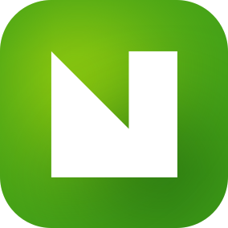
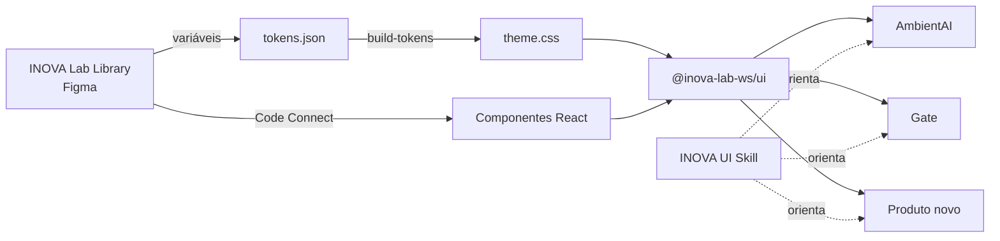

<div align="center">



# INOVA UI

### Componentes, tokens e logos do INOVA Lab · Leroy Merlin Brasil

*Um desenho no Figma, um pacote em código, a mesma interface em todo produto.*

`inova-ui` é o repositório. **`@inova-lab-ws/ui`** é o pacote que os apps instalam.

[](https://www.figma.com/design/Ze0WiY6G9j2yLxKb55dDMK/INOVA-Lab-Library)
[](https://github.com/INOVA-Lab-WS/inova-ui)
[](https://github.com/INOVA-Lab-WS/inova-ui/pkgs/npm/ui)

</div>

> [!IMPORTANT]
> **🔒 Fonte única de interface do INOVA Lab.** AmbientAI, Gate e todo produto novo instalam este pacote.
> **Nenhum app cria componente de interface próprio nem copia o código daqui.** O que faltar é pedido por
> [issue](https://github.com/INOVA-Lab-WS/inova-ui/issues). Dono e único aprovador: [@gabriel-moma-lmbr](https://github.com/gabriel-moma-lmbr).

[Como funciona](#como-funciona) · [Instalar](#instalar) · [Componentes](#componentes) ·
[Tokens](#tokens) · [Pedir algo novo](#pedir-algo-novo) · [Desenvolver](#desenvolver)

## 🔆 O caminho de uma mudança

```text
1. Desenhar     → o componente ou token nasce na INOVA Lab Library (Figma) e é publicado
2. Exportar     → as variáveis viram tokens/tokens.json; o tema é gerado (npm run tokens)
3. Implementar  → o componente entra em src/components, com Code Connect para o Figma
4. Lançar       → uma release no GitHub publica a nova versão do pacote
5. Atualizar    → cada app sobe a versão da dependência; nada é copiado
```

**O Figma desenha, o pacote implementa, a [INOVA UI Skill](#skill) orienta o uso.** Valor que não
passou pela biblioteca não entra aqui; componente que não está aqui não existe no app.

<a id="como-funciona"></a>

## 🎯 Como funciona



<a id="instalar"></a>

## 📦 Instalar num projeto

**1. Dependência.** Público no npm, sem token nem `.npmrc`. O projeto precisa de React 19, **Tailwind 4
(obrigatório)** e `lucide-react` 1.x (o pacote usa a cópia do app).

```bash
npm install @inova-lab-ws/ui lucide-react
```

**2. Tema.** No CSS global, e nenhum outro tema:

```css
@import "@inova-lab-ws/ui/theme.css";
@source "../node_modules/@inova-lab-ws/ui/dist";
```

**3. Fontes.** Com `next/font`, declare as variáveis `--font-inter`, `--font-instrument-serif` e
`--font-roboto-mono`; o tema lê essas variáveis antes do nome da família.

**4. Usar.**

```tsx
import { Button, Alert, Toast, ToastViewport } from "@inova-lab-ws/ui";

<Button variant="primary">Salvar pedido</Button>
<Alert tone="warning" title="Dados de exemplo">Ainda não há eventos reais neste servidor.</Alert>

// Botão que leva a outra página
<Button asChild><Link href="/novo">Adicionar</Link></Button>
```

**Página montada no servidor:** os componentes são código de navegador. Para dar o visual do pacote a um elemento
numa página do servidor, use `import { buttonVariants, cn } from "@inova-lab-ws/ui/variants";`.

**Projeto sem Tailwind:** instale `tailwindcss` e `@tailwindcss/postcss`, crie `postcss.config.mjs`, importe o tema e
isole o CSS antigo numa camada (`@import "./legacy.css" layer(components);`). O passo a passo está na skill INOVA UI.

<a id="componentes"></a>

## 🧩 Componentes

Todos os componentes da INOVA Lab Library estão no pacote, cada um com Code Connect em `figma/`.

**Indicadores**

| Componente | No Figma |
| :--- | :--- |
| `Badge` | `badge` |
| `Spinner` | `spinner` |
| `Tooltip · TooltipProvider` | `tooltip` |
| `Avatar` | `avatar` |
| `BotAvatar` | `bot-avatar` |
| `Divider` | `divider` |
| `Alert` | `alert` |
| `Toast · ToastViewport` | `toast` |
| `Chip` | `chip` |
| `ConnectorCard` | `connector-card` |

**Navegação**

| Componente | No Figma |
| :--- | :--- |
| `NavigationTabBar` | `navigation-tab-bar` |
| `Menu` | `menu` |
| `PillTab · PillTabs` | `pill-tab` |

**Estrutura**

| Componente | No Figma |
| :--- | :--- |
| `Header` | `header` |
| `TopArea` | `top-area` |
| `PageHeader` | `page-header` |
| `Accordion · AccordionItem` | `accordion` |

**Logos**

| Componente | No Figma |
| :--- | :--- |
| `LogoAmbientAI` | `logo / ambientai` |
| `LogoGate` | `logo / gate` |
| `LogoFormaLab` | `logo / forma-lab` |
| `LogoInovaUI` | `logo / inova-ui` |
| `LogoPlaceholder` | `logo / placeholder` |

**Formulário**

| Componente | No Figma |
| :--- | :--- |
| `Button` | `button` |
| `Input` | `input` |
| `Textarea` | `textarea` |
| `Checkbox` | `checkbox` |
| `Radio` | `radio` |
| `RoleRadio` | `role-radio` |
| `Toggle` | `toggle` |
| `MultiSelect` | `multi-select` |
| `DateRangePicker · DateRangeDay` | `date-range-picker` |
| `LoginForm` | `login-form` |
| `CopyField` | `copy-field` |

**Overlay**

| Componente | No Figma |
| :--- | :--- |
| `Overlay (dialog, drawer, bottom sheet)` | `overlay` |
| `ActionMenu · ActionMenuTrigger · ActionMenuContent · ActionMenuItem · ActionMenuSeparator` | `action-menu` |
| `ProfileMenu` | `profile-menu` |

**Dados e gráficos**

| Componente | No Figma |
| :--- | :--- |
| `MetricTile` | `metric-tile` |
| `ProgressReadout` | `progress-readout` |
| `BarChart` | `bar-chart` |
| `HorizontalBarChart` | `horizontal-bar-chart` |
| `StackedBarChart` | `stacked-bar-chart` |
| `DistributionChart` | `distribution-chart` |
| `Table · TableRow · TableCell` | `table` |
| `ActivityLog · ActivityLogRow` | `activity-log` |

**Conversa**

| Componente | No Figma |
| :--- | :--- |
| `UserMessage` | `user-message` |
| `AssistantMessage` | `assistant-message` |
| `Composer` | `composer` |
| `InputCard` | `input-card` |
| `ListeningBanner` | `listening-banner` |
| `Waveform` | `waveform` |
| `MentionResult` | `mention-result` |
| `SuggestionList` | `suggestion-list` |
| `FeedbackPrompt` | `feedback-prompt` |
| `ActionCard` | `action-card` |
| `MetaRow` | `meta-row` |
| `GenerationBoard` | `generation-board` |
| `HistoryThumbnail` | `history-thumbnail` |
| `Thumbnail` | `thumbnail` |
| `ProductListRow` | `product-list-row` |

<a id="tokens"></a>

## 🎨 Tokens

**Escala 4/8.** Tudo é múltiplo de 4, no ritmo de 8.

| Tipo | Valores |
| :--- | :--- |
| Raio | 0 · 4 · 8 · 12 · 16 · 24 · pill |
| Espaçamento | 4 · 8 · 12 · 16 · 20 · 24 · 32 · 40 · 48 · 64 |
| Fonte | 12 · 14 · 16 · 20 · 24 · 32 · 40 · 48 |
| Exceção | `chart-axis` 10px, só em eixo e rótulo de gráfico |

[`tokens/tokens.json`](tokens/tokens.json) é exportado da biblioteca e [`src/styles/theme.css`](src/styles/theme.css)
é gerado a partir dele. **Não edite o CSS à mão.**

<a id="pedir-algo-novo"></a>

## 🙋 Pedir algo novo

1. **Abra uma [issue](https://github.com/INOVA-Lab-WS/inova-ui/issues)** com a tela, o caso de uso e por que nenhum componente atual serve.
2. **O dono desenha primeiro na biblioteca**, publica e só então implementa aqui.
3. **Sai uma nova versão**, e o app atualiza a dependência.

> [!WARNING]
> **Variante local é divergência.** `className` serve para posicionar (margem, largura, alinhamento), nunca para
> mudar cor, tamanho ou borda. Valor solto (`text-[15px]`, `rounded-[10px]`, hex) também não entra no app.

<a id="desenvolver"></a>

## 🛠️ Desenvolver

```bash
npm install
npm run tokens            # regenera src/styles/theme.css a partir de tokens/tokens.json
npm run check             # typecheck + build
npx figma connect parse   # valida o Code Connect
```

| Caminho | O que é |
| :--- | :--- |
| `tokens/tokens.json` | os tokens exportados da INOVA Lab Library |
| `scripts/build-tokens.mjs` | gera o tema (variáveis CSS + mapeamento do Tailwind 4) |
| `src/components/` | os componentes React |
| `figma/` | o Code Connect de cada componente |
| `assets/` | o logo do INOVA UI |

**Publicar o pacote:** criar uma release no GitHub com a versão do `package.json`; o workflow `publish.yml`
publica no npm público com proveniência (trusted publishing, sem token). **Publicar o Code Connect:** `FIGMA_ACCESS_TOKEN=… npx figma connect publish`
(exige plano Organization ou Enterprise no Figma).

<a id="skill"></a>

## 🧭 INOVA UI Skill

A skill (`skills/inova-ui-skill`) é o guia de uso: como instalar, qual componente usar em cada caso, os padrões
de tela (área segura, overlays, estados, texto em pt-BR) e o que é proibido. **Ela orienta; o pacote decide o visual.**

---

<div align="center">

*INOVA Lab · Leroy Merlin Brasil*

</div>
